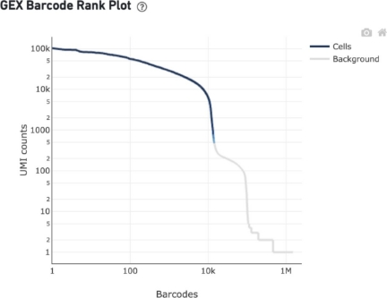
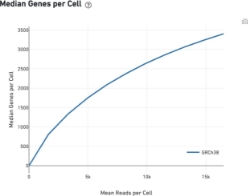
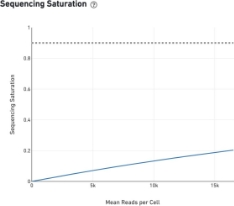
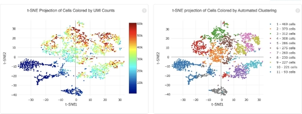
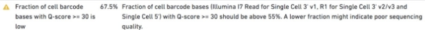

# Understanding the CellRanger output

The run summary from cellranger count can be viewed by clicking "Summary" in the top left corner. The summary metrics describe sequencing quality and various characteristics of the detected cells. Similar web summaries are also output from the cellranger reanalyze and cellranger aggr pipelines.

This report will serve you as first-line feedback on how the experiment went. It provides an easily accessible summary to scrutinize the success of the experiment.

It will help answering the questions like: 

- What is the quality of the run?
- How many cells do you have?
- Is the cell count estimate credible?
- Was the sample sequenced deep enough? Where the cells intact and well?
- Is the quality of the cells uniform?

Note that some of these questions will be more definitively answered during a successive (more hands-on) part of QC process. Consider this just the beginning of the scrutiny.

**\*Basic QC metrics\***

The number of cells detected, the mean reads per cell, and the median genes detected per cell are prominently displayed near the top of the page.

*Estimated Cell number -* is determined from the number of cell barcodes with ‘reasonable’ numbers of observations. This number is an *estimate* because there is no binary flag “full/empty” that tell us if a droplet had or not a cell inside. Every droplet will enter in contact with some free-floating RNA, therefore some threshold needs to be set to cell associated barcodes vs noise from empty GEMs. However, this threshold cannot be a fixed number as it will depend on the overall quality of the experiment, size of the cells and depth of the sequences and mis-called sequences. So, this number automatically estimated from the “Barcode Rank Plot” that we will see below.

Note: this number is estimated using the thresholds to cellranger count as a bias, if the threshold is changed the count can give different predictions, and in some cases it will be necessary to do so. For example. to account for a not-so-successful experiment with high level of free-floating mRNA in the input cell suspension or a lysis caused mixing the RT mix with the cell suspension.

*Mean Read per cell* - This is the mean of sequencing reads that is obtained on average to the cells. Note that this refers only to the ones counted in “Estimated number of cells” and therefore: 

*Estimated\_Cell\_number \* Mean\_Read\_per\_cell ≠ Illumina\_Reads*.

Also note that this number DOES NOT correspond to the number of UMI per cells (the value that is actually used for the analysis).

On the basis of what learned in the lectures can you explain how Mean Reads per cell and UMI count are related? How is UMI count obtained by the pipeline? Will doubling the number of reads double the number of UMIs?

**\*Diagnostic QC metrics – Sequencing\***

**Number of Reads**

Total number of read pairs that were assigned to this library in demultiplexing.

**Valid Barcodes**

Fraction of reads with barcodes that match the whitelist after barcode correction.

**Sequencing Saturation**

The fraction of reads originating from an already-observed UMI. This is a function of library complexity and sequencing depth. More specifically, this is the fraction of confidently mapped, valid cell-barcode, valid UMI reads that had a non-unique (cell-barcode, UMI, gene). This metric was called "cDNA PCR Duplication" in versions of Cell Ranger prior to 1.2.

**Q30 Bases in Barcode**

Fraction of cell barcode bases with Q-score >= 30, excluding very low quality/no-call (Q <= 2) bases from the denominator.

**Q30 Bases in RNA Read**

Fraction of RNA read bases with Q-score >= 30, excluding very low quality/no-call (Q <= 2) bases from the denominator. This is Read 1 for the Single Cell 3' v1 chemistry and Read 2 for the Single Cell 3' v2 chemistry.

**Q30 Bases in Sample Index**

Fraction of sample index bases with Q-score >= 30, excluding very low quality/no-call (Q <= 2) bases from the denominator.

**Q30 Bases in UMI**

Fraction of UMI bases with Q-score >= 30, excluding very low quality/no-call (Q <= 2) bases from the denominator.

**\*Diagnostic QC metrics – Mapping\***

**Reads Mapped to Genome**

Fraction of reads that mapped to the genome.

**Reads Mapped Confidently to Genome**

Fraction of reads that mapped uniquely to the genome. If a gene mapped to exonic loci from a single gene and also to non-exonic loci, it is considered uniquely mapped to one of the exonic loci.

**Reads Mapped Confidently to Intergenic Regions**

Fraction of reads that mapped uniquely to an intergenic region of the genome.

**Reads Mapped Confidently to Intronic Regions**

Fraction of reads that mapped uniquely to an intronic region of the genome.

**Reads Mapped Confidently to Exonic Regions**

Fraction of reads that mapped uniquely to an exonic region of the genome.

**Reads Mapped Confidently to Transcriptome**

Fraction of reads that mapped to a unique gene in the transcriptome. The read must be consistent with annotated splice junctions. These reads are considered for UMI counting.

**Reads Mapped Antisense to Gene**

Fraction of reads confidently mapped to the transcriptome, but on the opposite strand of their annotated gene. A read is counted as antisense if it has any alignments that are consistent with an exon of a transcript but antisense to it, and has no sense alignments.

## **\*Ranked Barcode Plot\***

The Barcode Rank Plot under the "Cells" dashboard shows the distribution of barcode counts and which barcodes were inferred to be associated with cells. It is one of the most informative QC plots, it enables one to assess sample quality and to formulate hypothesis of what might have gone wrong if the experiment was not perfectly successful.

To obtain this plot, reads are grouped by barcode, the number of UMI is counted, resulting in a vector of UMI count per barcode (note: one barcode - one GEM!). The counts are then sorted and the vector is displayed in rank vs counts plot:

The y-axis is the number of UMI counts mapped to each barcode and the x-axis is the number of barcodes below that value.

Note that due to the high number of GEMs with at least one UMI the only way to visualize all the data is a log-log axes plot.

How does one interpret the plot? What to expect?

Ideally there is a steep dropoff separating high UMI count cells from low UMI count background noise:

A steep drop-off is indicative of good separation between the cell-associated barcodes and the barcodes associated with empty partitions.

Barcodes can be determined to be cell-associated based on their UMI count or by their RNA profiles, therefore some regions of the graph can contain both cell-associated and background-associated barcodes.

The color of the graph represents the local density of barcodes that are cell-associated.

In fact, the cutoff is determined with a two-step procedure:

- It uses a cutoff based on total UMI counts of each barcode to identify cells. This step identifies the primary mode of high RNA content cells.
- Then the algorithm uses the RNA profile of each remaining barcode to determine if it is an “empty" or a cell containing partition. This second step captures low RNA content cells, whose total UMI counts may be similar to empty GEMs.

**\*Saturation - is there a gain in sequencing more?\***

The sequencing saturation plot allows the user to assess the relative tradeoffs of sequencing deeper or shallower. As sequencing saturation increases, the total number of molecules detected in the library increases, but with diminishing returns as saturation is approached.

A good rule of thumb for most cell types is that: An average of 40k reads per cell is a minimal sufficient that with 80k reads being usually an excellent depth. There is certainly gain in sequencing more but it is not cost-effective in general. So, it is important to evaluate if going deeper has a value to your scientific question.

## **\*Analysis view\***

The automated secondary analysis results can be viewed by clicking "Analysis" in the top left corner. The secondary analysis provides the following:

A dimensional reduction analysis which projects the cells into a 2-D space (t-SNE), including an automated clustering analysis which groups together cells that have similar expression profiles.

A list of genes that are differentially expressed between the selected clusters

Plots showing the effect of decreased sequencing depth on observed library complexity and on median genes per cell detected

## **\*Troubleshooting: when things go bad\***

For other situations like these two below, there is usually little you can do and you’d better contact 10X genomics support and/or the sequencing core facility at your institution

**Task 3: We provide you with some web\_summary.html files. Use what you have learned above to evaluate each one of the experiments and write a short evaluation of what you observe at least ~50 words per each file. When you write a short summary, imagine you are reporting to your supervisor about how the experiment went.**

